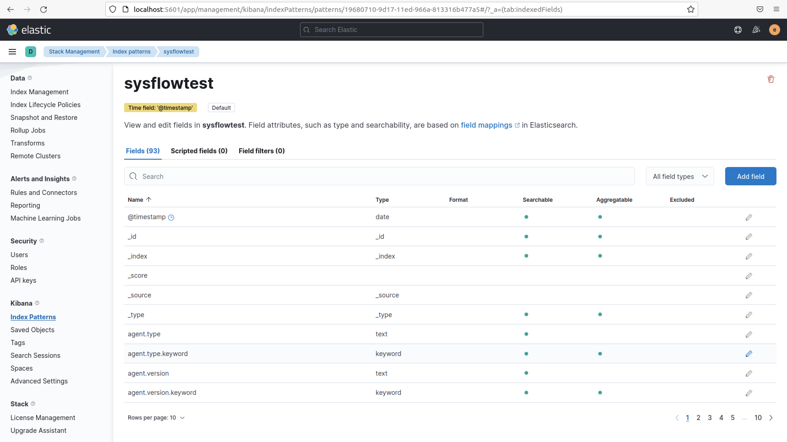
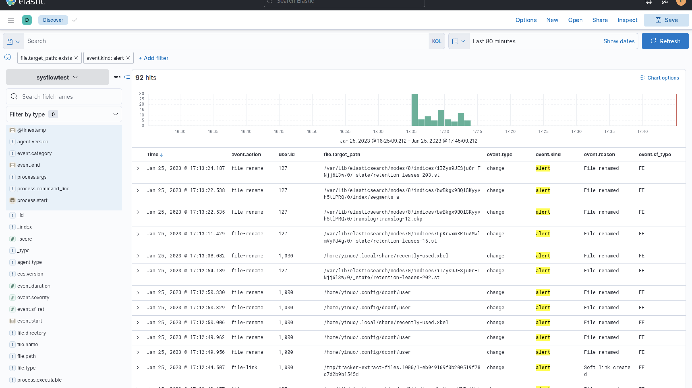

# Background

## MITRE Tags

- **Tactic**: short-term, tactical and adversary **goals** during an attack. Tactics represent the “why” of an ATT&CK technique or sub-technique. It is the adversary’s tactical goal: **the reason for performing an action**. *For example, an adversary may want to achieve credential access.*
- **Technique**: the **means** by which adversaries achieve tactical goals. Techniques represent “how” an adversary achieves a tactical goal by performing an action. *For example, an adversary may dump credentials to achieve credential access.*
- **Sub-techniques**: **more specific means** by which adversaries achieve tactical goals at a lower level than techniques. Sub-techniques are a more specific description of the adversarial behavior used to achieve a goal. They describe behavior at a lower level than a technique. *For example, an adversary may dump credentials by accessing the Local Security Authority (LSA) Secrets.*
	- **SysFlow tags are at sub-technique level**
- **Procedures**: **specific implementation** the adversary uses for techniques or sub-techniques. *For example, a procedure could be an adversary using PowerShell to inject into lsass.exe to dump credentials by scraping LSASS memory on a victim.* Procedures are categorized in ATT&CK as the observed in the wild use of techniques in the "Procedure Examples" section of technique pages.

> Tags generated by SysFlow processor are at technique/sub-technique level

# SysFlow

#HIDS

- [x] [eBPF](https://www.brendangregg.com/blog/2019-01-01/learn-ebpf-tracing.html)
- [x] [ECS](https://www.elastic.co/guide/en/ecs/current/ecs-reference.html)
- [x] [Elasticsearch](https://03ea669492ba4ff29c96fde238b88673.us-central1.gcp.cloud.es.io:9243/app/home#/)
- [x] [ttp policies](https://github.com/sysflow-telemetry/sf-processor/blob/master/resources/policies/runtimeintegrity/ttps.yaml)
	- [x] [Falco rules](https://falco.org/docs/rules/)
	- [x] [MITRE tag API](https://nbviewer.org/github/sysflow-telemetry/sf-apis/blob/master/pynb/notebooks/MitreTagTimeline/MitreTagTimeline.ipynb)
- [x] [pipeline-template](https://github.com/sysflow-telemetry/sf-processor/blob/master/resources/pipelines/pipeline.template.json)

*Deployment troubleshooting*
```{bash}
sudo apt install clang-9 --install-suggests
sudo apt-get install -y make
sudo xdg-open /etc/sysflow/conf/sysflow.env
journalctl -u sysflow-collector.service
```

*Exporter configuration: file*
```
{
  "pipeline":[
    {
     "processor": "sysflowreader",
     "handler": "flattener",
     "in": "sysflow sysflowchan",
     "out": "flat flattenerchan"
    },
    {
     "processor": "policyengine",
     "in": "flat flattenerchan",
     "out": "evt eventchan",
     "policies": "/etc/sysflow/policies/distribution/filter.yaml",
     "mode": "alert"
    },
    {
     "processor": "exporter",
     "in": "evt eventchan",
     "export": "file",
     "format": "json",
     "file.path": "./export.out"
    }
  ]
}
```

```
sudo find / -name export.out
```

*Example record*
```
{
"version":4,
"endts":0,
"opflags":["EXEC"],
"ret":0,
"ts":1674666938413620076,
"type":"PE",
"meta":{"schema":3,"tracename":"."},
"node":{"id":"ubuntu","ip":"172.16.252.131"},
"pproc":{"args":"-u sysflow-processor.service","cmdline":"/usr/bin/journalctl -u sysflow-processor.service","createts":1674666938405000538,"entry":false,"exe":"/usr/bin/journalctl","gid":1000,"group":"yinuo","name":"journalctl","oid":"f850feba47bbfc33","pid":26102,"tty":true,"uid":1000,"user":"yinuo"},
"proc":{"acmdline":["/usr/bin/journalctl -u sysflow-processor.service","/usr/bin/journalctl -u sysflow-processor.service","/usr/bin/bash","/usr/libexec/gnome-terminal-server","/usr/lib/systemd/systemd --user","/usr/lib/systemd/systemd auto noprompt"],
"aexe":["/usr/bin/journalctl","/usr/bin/journalctl","/usr/bin/bash","/usr/libexec/gnome-terminal-server","/usr/lib/systemd/systemd","/usr/lib/systemd/systemd"],"aname":["journalctl","journalctl","bash","gnome-terminal-server","systemd","systemd"],
"apid":[26103,26102,4318,4309,3563,1],"
args":"",
"cmdline":"/usr/bin/pager ","createts":1674666938412573652,"entry":false,"exe":"/usr/bin/pager","gid":1000,"group":"yinuo","name":"pager","oid":"4f3a00377f48daf9","pid":26103,"tid":26103,"tty":true,"uid":1000,"user":"yinuo"},
"policies":[{"id":"Execution of a file","desc":"Execution of a file","priority":0}],"tags":["test"]}
```

Setup [ELK](https://phoenixnap.com/kb/how-to-install-elk-stack-on-ubuntu)

*Exporter configuration: ELK*
```
{
  "pipeline":[
    {
     "processor": "sysflowreader",
     "handler": "flattener",
     "in": "sysflow sysflowchan",
     "out": "flat flattenerchan"
    },
    {
     "processor": "policyengine",
     "in": "flat flattenerchan",
     "out": "evt eventchan",
     "policies": "/etc/sysflow/policies/distribution/filter.yaml",
     "mode": "alert"
    },
    {
     "processor": "exporter",
     "in": "evt eventchan",
     "export": "es",
     "format": "ecs",
     "es.addresses": "http://localhost:9200",
     "es.username": "elastic",
     "es.password": "passwd",
     "es.index": "sysflowtest"
    }
  ]
}
```





*[Policies](https://sysflow.readthedocs.io/en/latest/processor.html#policy-language)*: ```/etc/sysflow/policies/distribution/filter.yaml```
[mitre:t1059](https://attack.mitre.org/techniques/T1059/)
```
###### Rules about mitre:T1059 ####################
- rule: Interactive shell
  desc: Interactive shell detected
  condition: interactive and not entrypoint
  priority: low
  tags: [mitre:T1059]

- rule: Command and Scripting Interpreter
  desc: any network activity performed by shell interpreters that are not expected to send or receive any network traffic
  condition: sf.proc.name in (shell_binaries)
    and inbound_outbound
    and not login_doing_dns_lookup
    and not entrypoint
  priority: medium
  tags: [mitre:T1041, mitre:T1059]

- rule: Reverse Unix shell started
  desc: creation of a reverse shell process via nc
  condition: sf.opflags = EXEC and
             sf.proc.name in (netcat_cmds) and sf.proc.args pmatch (netcat_shell_args)
  priority: high
  tags: [mitre:T1059.004]
  prefilter: [PE]

- rule: Shell started by container entry point
  desc: Container entry point "node" starts shell sub-process
  condition: sf.opflags = EXEC and
             container and sf.pproc.name = node and sf.proc.name in (shell_binaries)
  priority: high
  tags: [mitre:T1059.004]
  prefilter: [PE]
```
> -   _priority_: label representing the severity of the alert can be: (1) low, medium, or high, or (2) emergency, alert, critical, error, warning, notice, informational, debug.

- **Rules** and **(sub) Techniques** are **not one-to-one** mapping. One rule might only cover a subset of possible instantiations of a sub-technique. 
- **Rules** have various levels of **priorities**, i.e., false positive rates. 
	- Background traffic (or legal user traffic) might have a significantly effect, especially for the rules with low priority.
	- It might be of interest to compare the efficacy of the same deception strategy guided by observations generated by rules of different priority.

# Snort

#NIDS #NIPS

- [ ] [install](https://linuxopsys.com/topics/install-snort-on-ubuntu)
- [ ] [snort rule writing guide](https://docs.snort.org/welcome)
- [ ] [generate alert](https://docs.snort.org/start/rules#generating-alerts)

- One advantage of Snort comes from its **Community Rules** contributed by the opensource community
- Snort does not support MITRE TTP tagging
- Snort supports alert generation of the same format as SysFlow (syslog).

# Security Onion

#HIDS #NIDS 

- [ ] [ATT&CK navigator](https://docs.securityonion.net/en/2.3/attack-navigator.html#attack-navigator)

